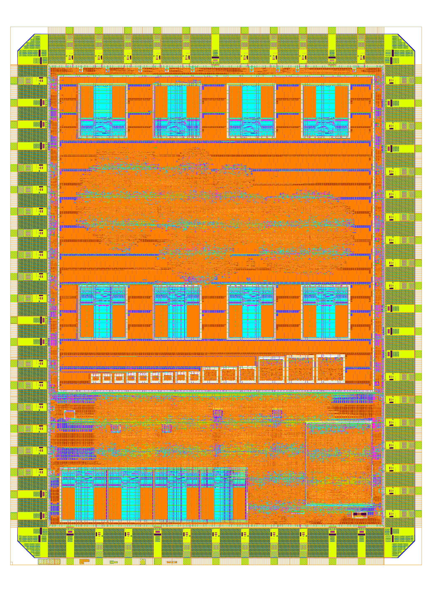
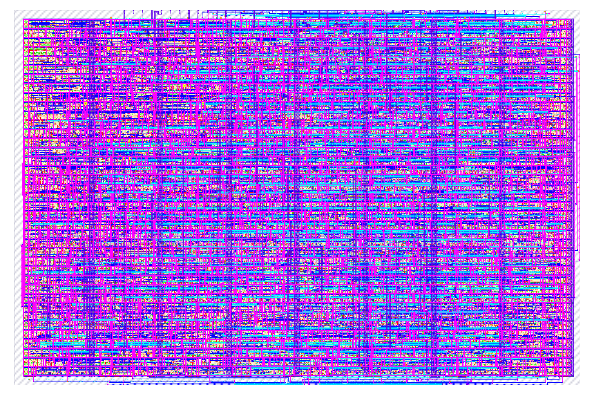
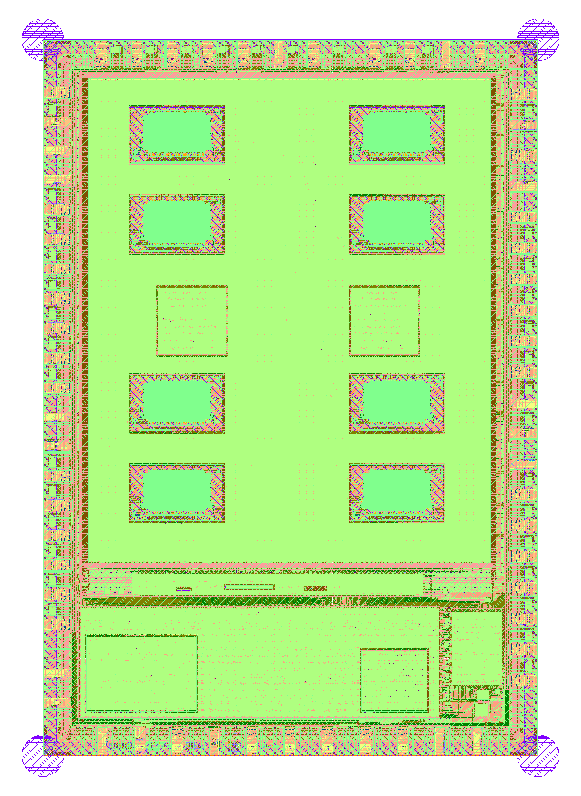
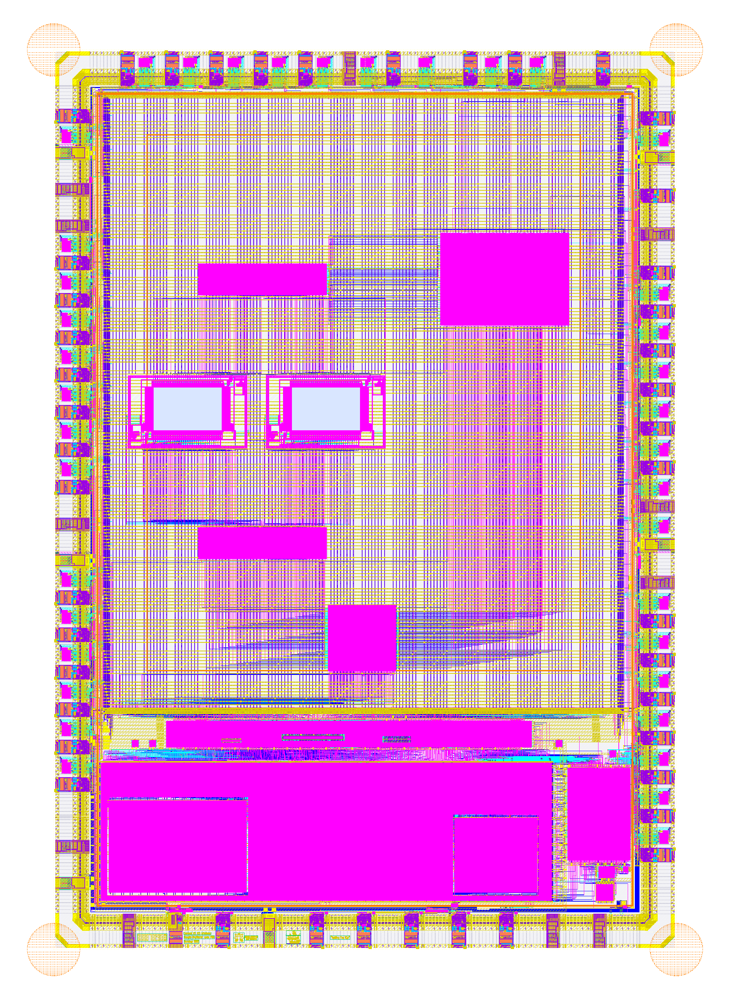

# Chip Gallery

This is the repository where I store the layout for chips that I have designed.

# LeoSoC GFMPW-1

A simple dual-core SoC with true random number generators as payload.

- Two RV32I cores running in parallel
- 32 word direct-mapped instruction cache for each core
- 4kB of shared memory
- SPI flash controller
- 2 UARTs
- 1 GPIO controller (24 I/Os)
- 15 different TRNGs

It uses the foundry provided 512x8 SRAM macros. In total there are 15 different TRNG configurations on board.

The design was submitted to the GFMPW-1 Shuttle Program.

[Project Link](https://github.com/mole99/leosoc-gfmpw-1)

# One Sprite Pony TT05

This Verilog design produces SVGA 800x600 60Hz output with a background and one sprite. Internally, the resolution is reduced to 100x75, thus one pixel of the sprite is actually 8x8 pixels. The design can operate at either a 40 MHz pixel clock or a 10 MHz pixel clock by setting a configuration bit.

The design was submitted to Tiny Tapeout 05 for production.

[Project Link](https://github.com/mole99/tt05-one-sprite-pony)

# LeoSoC MPW-8

This is a simple SoC with the following:

- 1 LeoRV32 Core (RV32I)
- 8 kB Work RAM
- 8 kB Video RAM (can also be used as Work RAM)
- SVGA Core (800 x 600, 40 MHz)
	- Resolution decreased to 100 x 75 pixel
	- 1 Byte per Pixel with direct color format (BBGGGRRR)
- UART
	- 9600 baud fixed at 40 MHz
- Blink
	- Simple output to blink an LED

# Waveform Generator MPW-7

A generic waveform generator divided into stimulus and driver units that can be arbitrarily interconnected.

Currently the following blocks are implemented:

### Stimuli

- `wfg_stim_sine`
- `wfg_stim_mem`

### Driver

- `wfg_drive_spi`
- `wfg_drive_pat`

### Various

- `wfg_interconnect`
- `wfg_core`
- `wfg_subcore`
