# Chip Gallery

This is the repository where I store the layout for chips or designs that I designed.

# GF180MCU FABulous FPGA (3.3V)

This is an improved version of my FABulous FPGA on wafer.space run 1. Notably, it uses 3.3V standard cells and SRAM macros, as well as 3.3V/5V compatible I/O cells. 

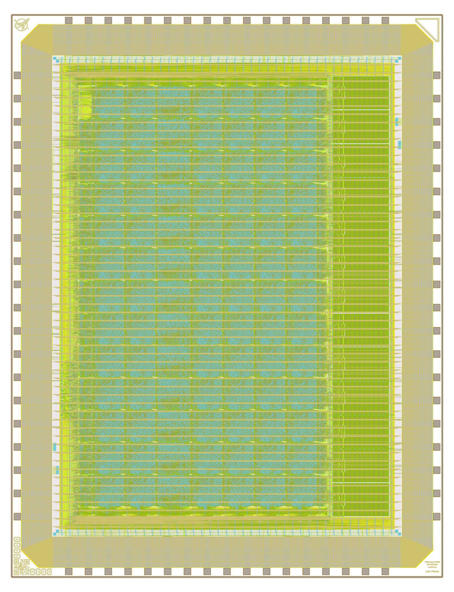

| Primitive | Available | Description |
|---|---|---|
| FABULOUS_LC | 624  | Logic cells with LUT4+FF and carry-chain. |
| GF_IOBUF | 48  | Input/output buffer. Configurable input type (cmos/schmitt), slew rate (fast/slow), pull-up, pull-down. |
| IDDR | 48  | Input double data rate buffer. |
| ODDR | 48  | Output double data rate buffer. |
| GBUF | 4  | Global buffer to supply clock, reset and enable to the flip-flops. |
| RAM_32x4_2R_1W | 13 | RAM that is 4 bit wide and 32 words deep. It has two read ports and one write port. |
| GF_SRAM_1024x8_1RW | 13 | SRAM with 1024x8 bits of data and one synchronous read/write port. |
| SYS_RESET | 1 | Can be used to reset the design after configuration. |
| WARMBOOT | 1 | Can be used to reset the design after configuration. |

- Repository: https://github.com/mole99/wsrun2-fabulous-fpga

# Tiny FABulous FPGA GF0p3 (3.3V)

Tiny FABulous FPGA for GF0p3.

| Tiny FABulous FPGA GF0p3 | Tiny FABulous FPGA GF0p3 (3.3V) |
|---|---|
| 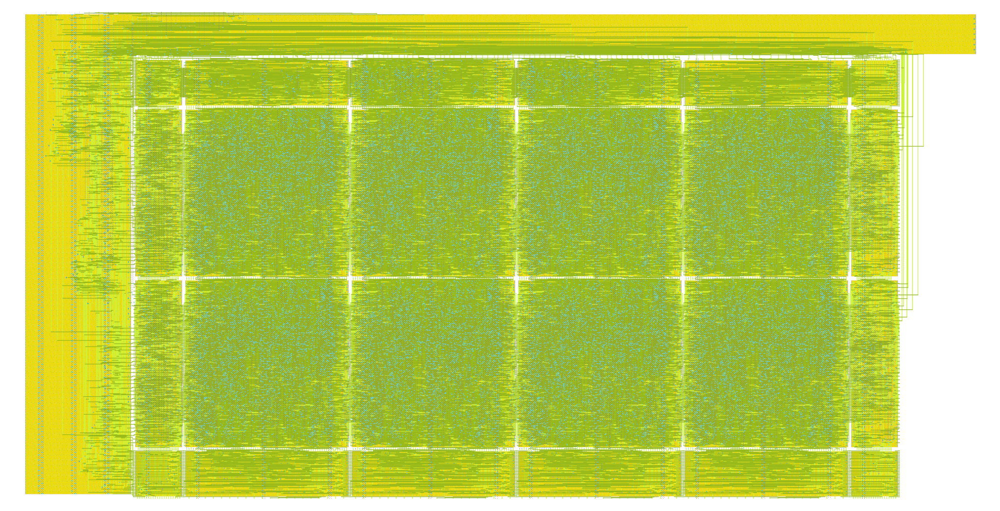 | 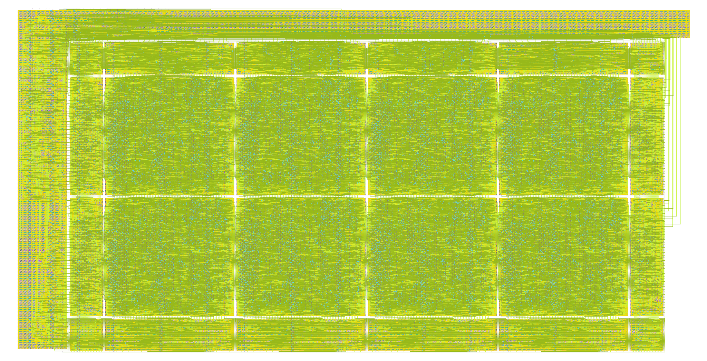  |

| Primitive | Available | Description |
|---|---|---|
| FABULOUS_LC | 64  | Logic cells with LUT4+FF and carry-chain. |
| IOBUF | 26  | Input/output buffers. |
| GBUF | 4  | Global buffers to supply clock, reset and enable to the flip-flops. |
| SYS_RESET | 1 | Can be used to reset the design after configuration. |

- Repository: https://github.com/mole99/tt-fabulous-gf-0p3
- Repository (3.3V): https://github.com/mole99/tt-fabulous-gf-0p3-3v3

# sky130 FABulous Test Chip

A test chip with three FABulous FPGA fabrics.

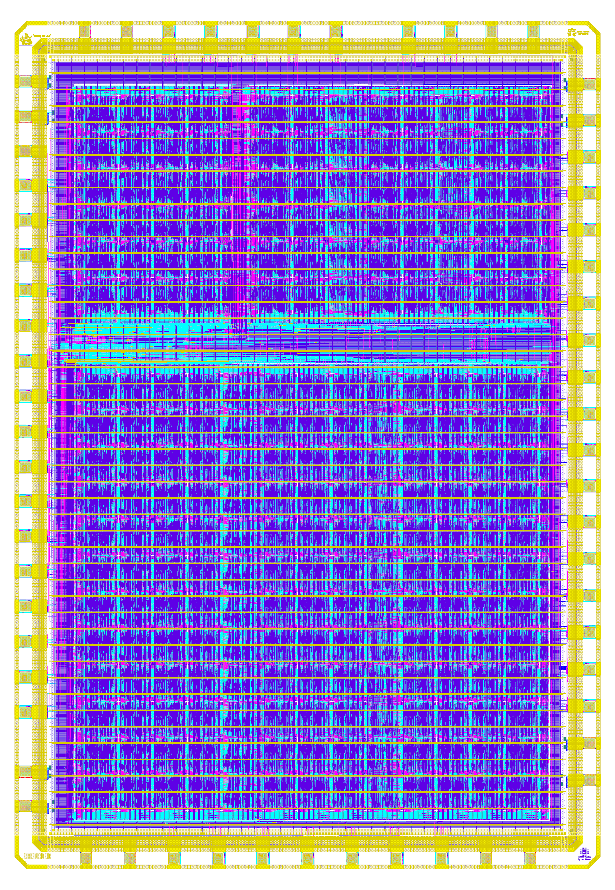

The following FPGA fabrics are available:

- classic_fabric_chipfoundry_small
  - 192x FABULOUS_LC
- classic_fabric_chipfoundry_medium
  - 288x FABULOUS_LC
  - 6x RAM_32x4_2R_1W
  - 3x MACC_8x8_20
- classic_fabric_chipfoundry_large
  - 1056x FABULOUS_LC
  - 12x RAM_32x4_2R_1W
  - 6x MACC_8x8_20

The chip will be packaged using ChipFoundry's QFN service.

Taped out on CI2605, May 2026 MPW Shuttle.

Repository: https://github.com/mole99/sky130-fabulous-testchip

# Tiny FABulous FPGA SKY26a/SKY26b

Tiny FABulous FPGA for SKY26a/SKY26b.

| Tiny FABulous FPGA SKY26a | Tiny FABulous FPGA SKY26b |
|---|---|
| 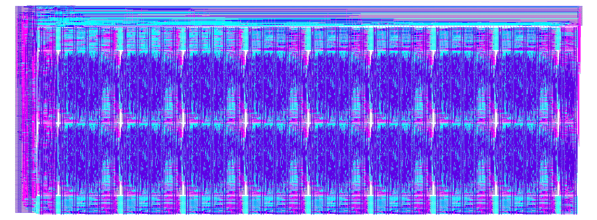  |   |

| Primitive | Available | Description |
|---|---|---|
| FABULOUS_LC | 128  | Logic cells with LUT4+FF and carry-chain. |
| IOBUF | 26  | Input/output buffers. |
| GBUF | 4  | Global buffers to supply clock, reset and enable to the flip-flops. |
| SYS_RESET | 1 | Can be used to reset the design after configuration. |

- Repository SKY26a: https://github.com/mole99/tt-fabulous-sky-26a
- Repository SKY26b: https://github.com/mole99/tt-fabulous-sky-26b

# HeiChips 2025

It's an open-source chip featuring user projects created by participants of the HeiChips Summer School 2025 (https://heichips.github.io/).
The chip uses 9mm² of silicon on SG13CMOS and has been submitted to IHP's Low-Cost MPW shuttle

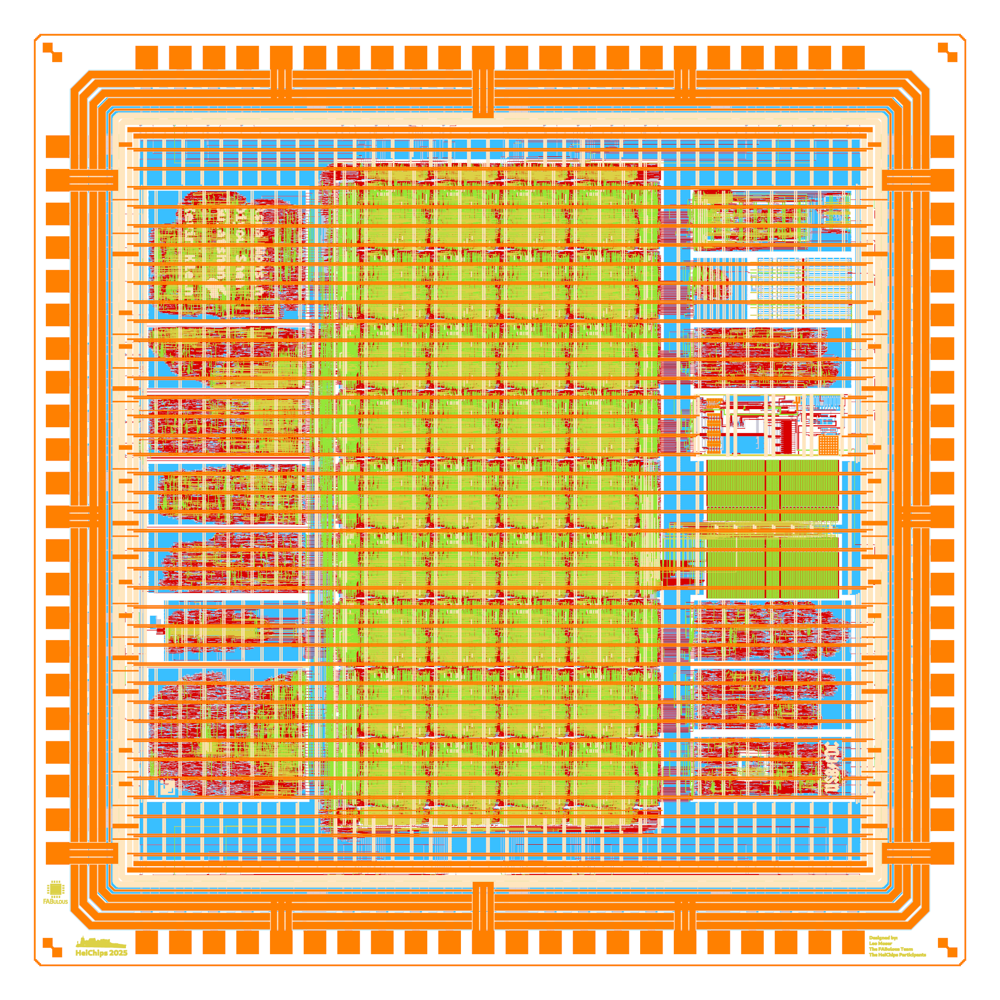

- [FABulous](https://github.com/FPGA-Research/FABulous) eFPGA
  - 32x I/Os
  - 288x LUT4 + FF
    - w. carry chain
  - 1x SRAM
    - 4 KiB memory: 32 bit wide, 10 bit deep (1024 entries)
    - individual bit-enable
  - 4x global buffers
  - 1x system reset

HeiChips 2025 repository: https://github.com/FPGA-Research/heichips25-tapeout

# Tiny FABulous FPGA IHP26a

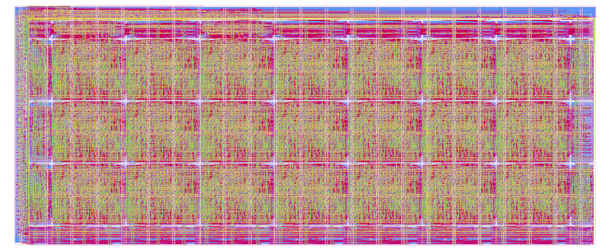

This design implements a tiny FPGA with 168 LUT4+FF. The FPGA fabric is 9x5 tiles in size, of which 7x3 are LUT4x8_ha tiles. The logic cells include a vertical carry-chain in upwards direction, allowing for fast additions up to 23-bits.

The I/Os resemble the Tiny Tapeout interface, allowing for clk, rst_n, uo, ui and uio signals. This enables to directly implement simple Tiny Tapeout designs on the FPGA.

The user design is synthesized using Yosys and implemented using nextpnr (currently forks are required to be used, but the changes will be upstreamed).

The bitstream is uploaded to the fabric using a bitbang interface (see how to test). The bitbang interface is active while reset is applied, this ensures that all I/Os are available for the active user design.

Repository: https://github.com/mole99/tt-fabulous-ihp-26a

# GF180MCU FABulous FPGA

A FABulous FPGA based on the project template for wafer.space MPW runs using the gf180mcu PDK.

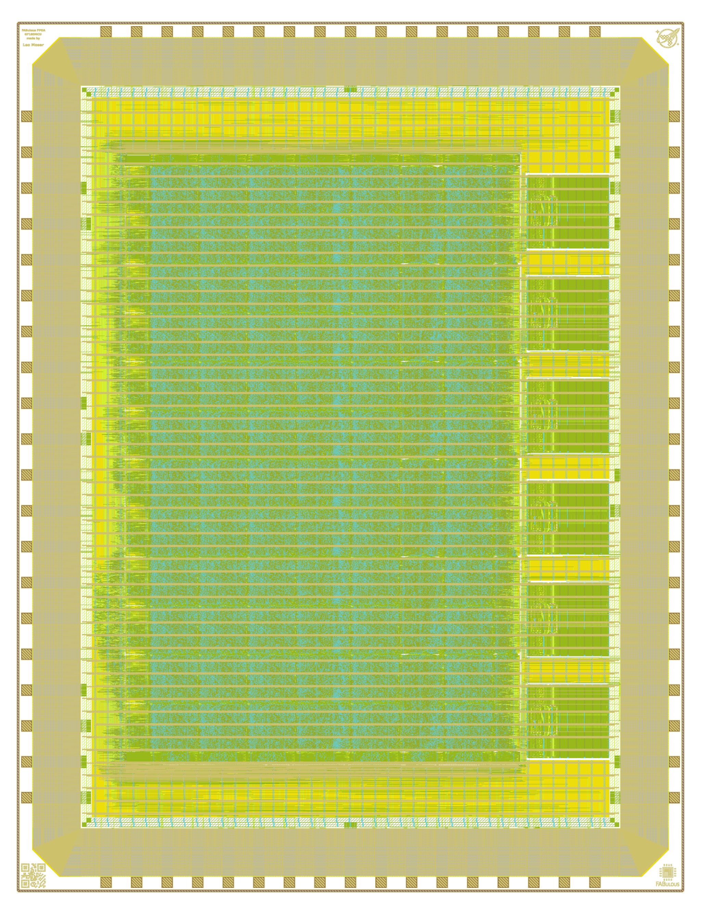

[GF180MCU FABulous FPGA](https://github.com/mole99/gf180mcu-fabulous-fpga) has been submitted to the first [wafer.space](https://wafer.space/) shuttle late 2025 for fabrication.

- [FABulous](https://github.com/FPGA-Research/FABulous) eFPGA
  - 48x I/Os
  - 480x LUT4 + FF
    - w. carry chain
  - 60x MUX
    - Either 1xMUX8, 2xMUX4 or 4xMUX2
  - 6x SRAM 512x8
    - individual bit-enable
  - 6x MAC
    - 8bit*8bit + 20bit
    - sign-extend
    - sync/async operands and/or ACC
  - 12x Register file
    - 32x4bit each
    - 1w1r1r
    - sync/async output
  - 1x Global clock network
  - 1x WARMBOOT
    - Trigger a reconfiguration from one of 16 slots
    - Provides a reset signal which is asserted during reconfiguration

# Panamax FPGA

A FABulous FPGA utilizing the Panamax padframe on SKY130.

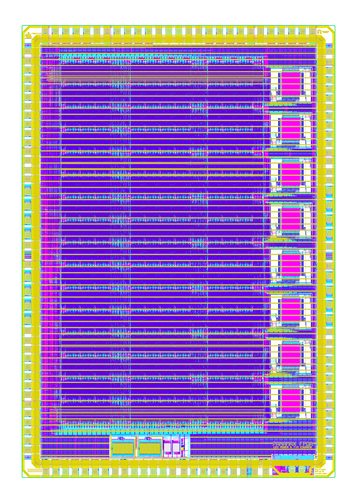

[Panamax FPGA](https://github.com/mole99/panamax-fpga) has been submitted to the Cadence SkyWater run in 2025 for fabrication.

- 64 I/Os
    * Pull-up / Pull-down
    * Open-drain
    * Slow / fast slew
- 1280 LCs (LUT4 + FF)
- 8 MAC (8-bit * 8-bit + 20-bit)
- 16 Register files (1w2r, 32x4)
- 8 BRAM (dual-ported 1r1rw, 256x32)
- 2 x 12-bit split-CDAC SAR ADC
- 2 x 8-bit R-DAC

# Greyhound IHP Revision 2 2025

A RISC-V SoC with tightly coupled eFPGA on IHP SG13G2

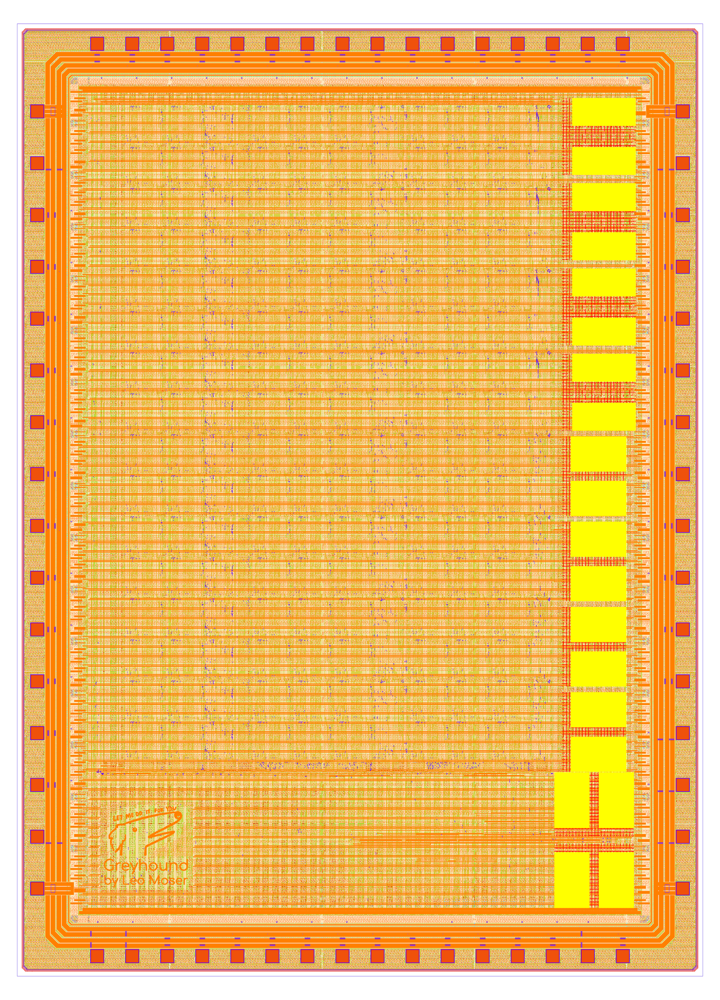

[Greyhound](https://github.com/mole99/greyhound-ihp) has been submitted to the [IHP-Open-DesignLib](https://ihp-open-ip.readthedocs.io/en/latest/) in September 2025 for fabrication.

- Designed using the [IHP Open Source PDK](https://github.com/IHP-GmbH/IHP-Open-PDK)
- SoC:
  - [CV32E40X](https://github.com/openhwgroup/cv32e40x) RISC-V core from the OpenHW group
  - 8 KiB SRAM
  - QSPI Flash Controller for XIP (w. cache, 16 lines)
  - QSPI PSRAM controller
  - Highly Configurable UART
  - Fabric Config Peripheral
  - Fabric Peripheral
- FABulous eFPGA
  - 32x I/Os
  - 1024x LUT4 + FF (w. carry chain)
  - 128x MUX (Either 1xMUX8, 2xMUX4 or 4xMUX2)
  - 4x SRAM (32 bit wide, 4 KiB)
  - 4x BRAM (16 bit wide, 2 KiB)
  - 8x MAC (8bit*8bit + 20bit)
  - 16x Register file (32x4bit each, 1w1r1r)
  - 1x Global clock network
  - 1x WARMBOOT
  - 1x CPU_IRQ
  - 1x OBI_PERIPHERAL (Open Bus Interface)
  - 1x CUSTOM_INSTRUCTION

# Greyhound IHP 2025

A RISC-V SoC with tightly coupled eFPGA on IHP SG13G2

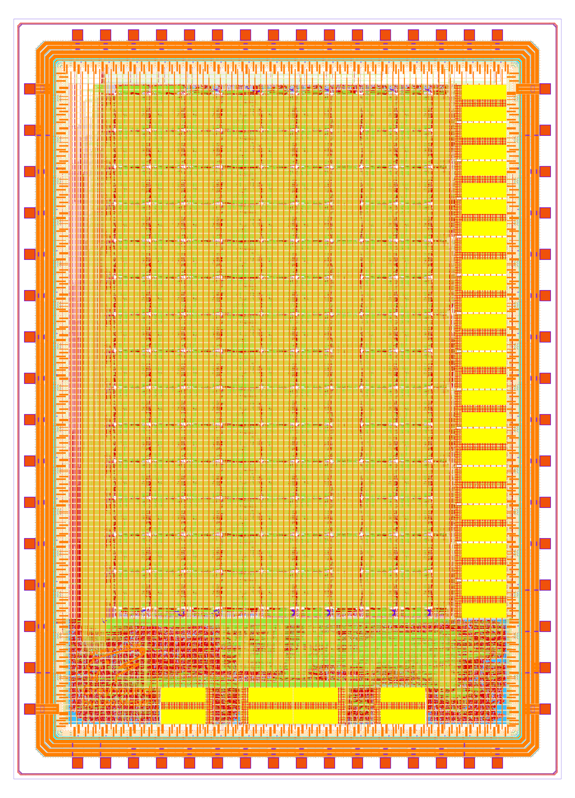

[Greyhound](https://github.com/mole99/greyhound-ihp) has been submitted to the [IHP-Open-DesignLib](https://ihp-open-ip.readthedocs.io/en/latest/) in April 2025 for fabrication.

- Designed using the [IHP Open Source PDK](https://github.com/IHP-GmbH/IHP-Open-PDK)
- SoC:
  - [CV32E40X](https://github.com/openhwgroup/cv32e40x) RISC-V core from the OpenHW group
  - 8kB SRAM
  - QSPI Flash Controller for XIP (w. cache, 8 lines)
  - QSPI PSRAM controller
  - Highly Configurable UART
  - Fabric Config Peripheral
  - Fabric Peripheral
- FABulous eFPGA
  - 32x I/Os
  - 784x LUT4 + FF (w. carry chain)
  - 98x MUX (Either 1xMUX8, 2xMUX4 or 4xMUX2)
  - 7x SRAM (32 bit-wide, 4kB deep)
  - 7x MAC (8bit*8bit + 20bit)
  - 14x Register file (32x4bit each, 1w1r1r)
  - 1x Global clock network
  - 1x WARMBOOT
  - 1x CPU_IRQ
  - 4x CPU_IF

Microscopy image: http://infosecdj.net/map/ihp/mole99-greyhound/infosecdj_mz_nikpa40x/#x=23424&y=32416&z=1
© 2026 InfoSecDJ, CC BY-NC 4.0

# Second Minimal Fab Design Contest 2025

Counter, Ringo, ROM and Stdcells

|   |   |   |
|---|---|---|
|  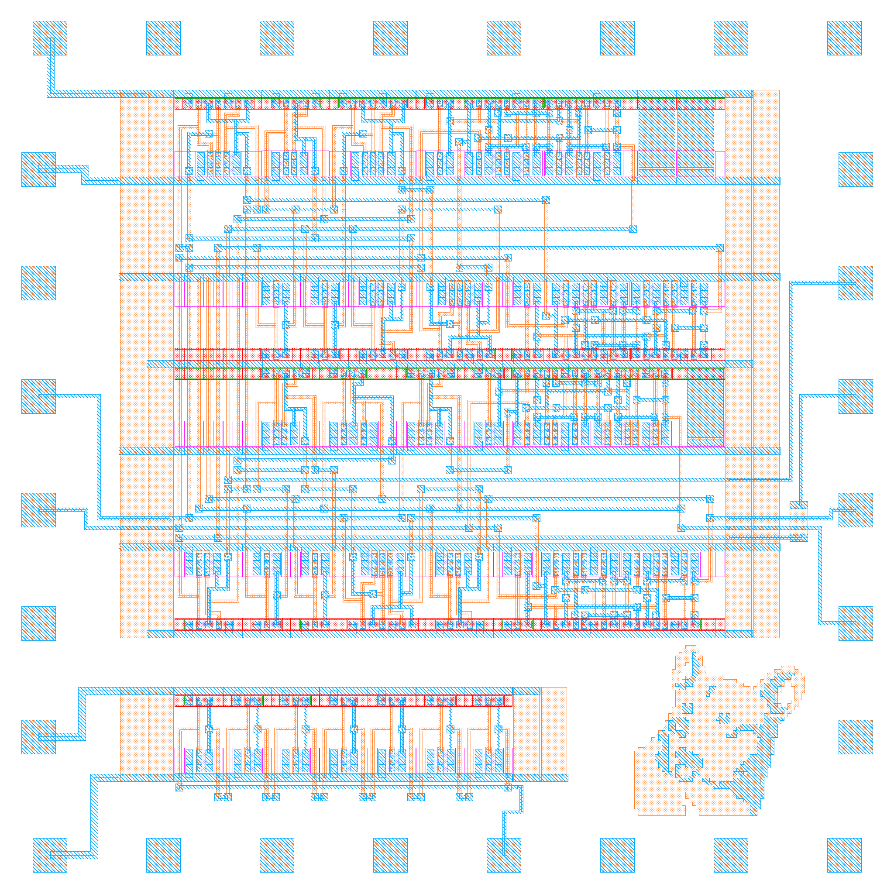 | 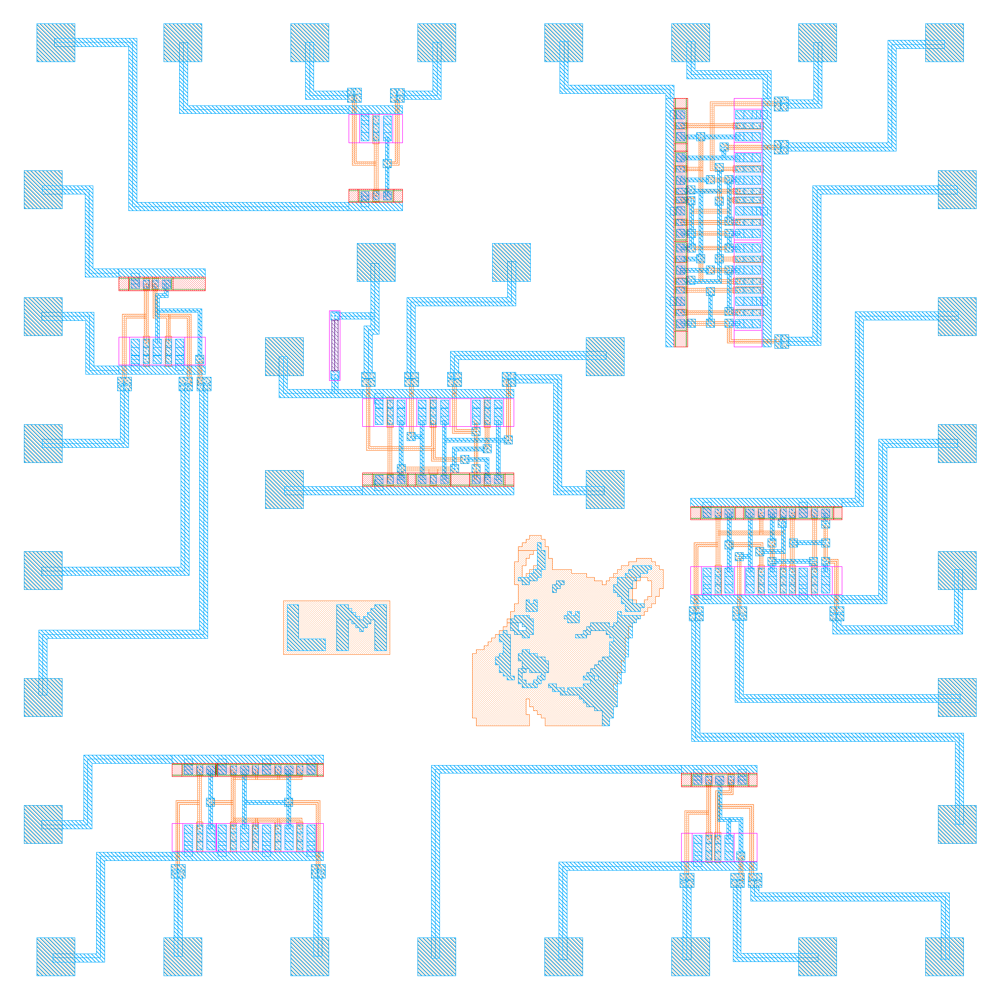  |  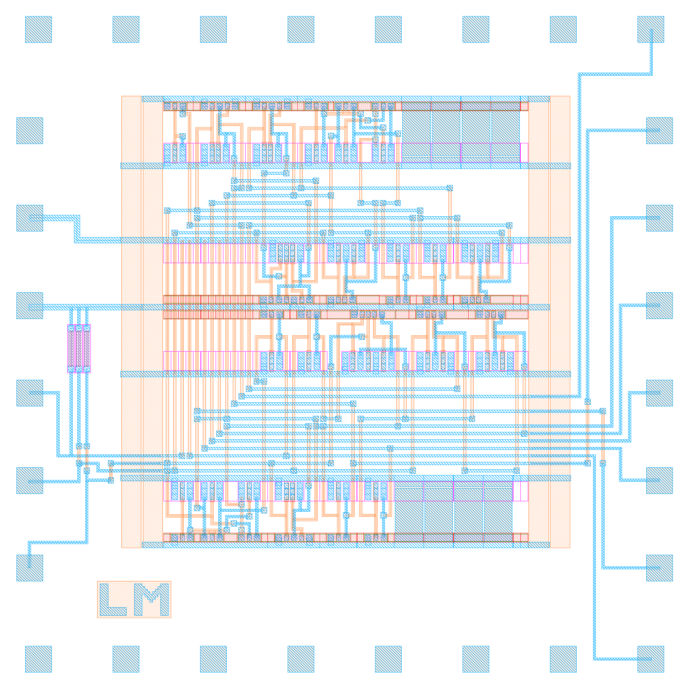 |

I submitted [three different designs](https://codeberg.org/mole99/minimalfab-design-contest-2024) to the second Minimal Fab Design Contest.

- Designed using the open source ICPS PDK
- Created a minimal stdcell library
- Wrote a simple Place and Route tool
- Created two submissions with a counter, ring-oscillator and ROM using my stdcell library and PnR tool
- Created one submission for the characterization of some of the stdcells

# One Sprite Pony (TTIHP0P2) 

SVGA sprite generator

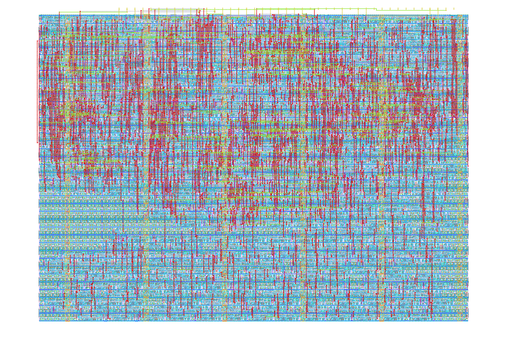

An updated version of [One Sprite Pony](https://github.com/mole99/ttihp0p2-one-sprite-pony) has been submitted to Tiny Tapeout IHP 0.2

- SVGA 800x600 60Hz output with 2 bits per color (internally reduced to 100x75)
- Sprite with 12x12 pixels
- 4 different colors (6 bit rrggbb)
- 4 different backgrounds
- Uses clock gating for the sprite shift register
- Simplified SPI interface
- Assign new sprite positions only on new line
- Clamp x and y position to prevent uncontrolled shifting of the sprite data

# AICD Playground TT08

A simple mixed-signal design

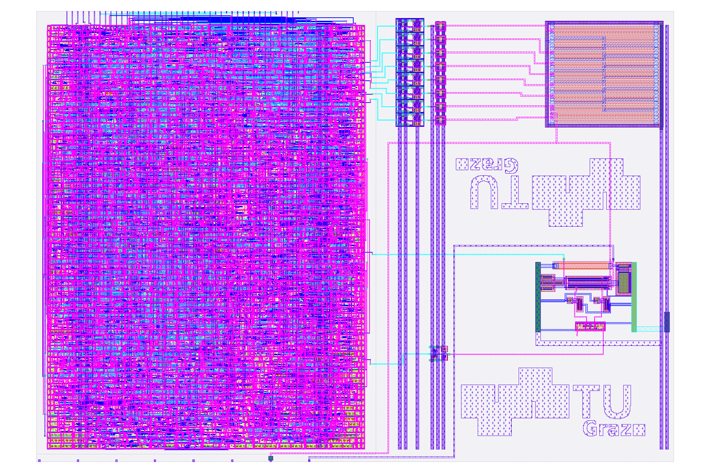

[AICD Playground](https://github.com/mole99/tt08-aicd-playground) has been submitted to Tiny Tapeout 08

- 8-bit CPU with 64 bytes of work memory
- Levelshifters in both directions
- 3.3V R2R-DAC
- 3.3V Comparator
- Can be programmed as SAR-ADC

# Wirecube TT08

VGA wirecube

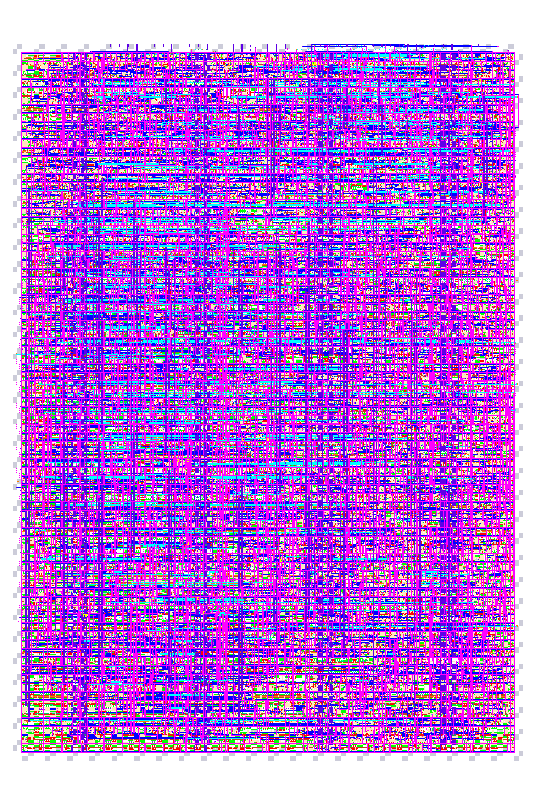

[Wirecube](https://github.com/mole99/tt08-wirecube) has been submitted to Tiny Tapeout 08 for the demoscene competition.

- VGA output at 640x480 @ 60 Hz
- Draws lines while racing the beam
- Displays a rotating cube in wireframe rendering

# TGFF Semicon23

Transmission-Gate D Flip-Flop

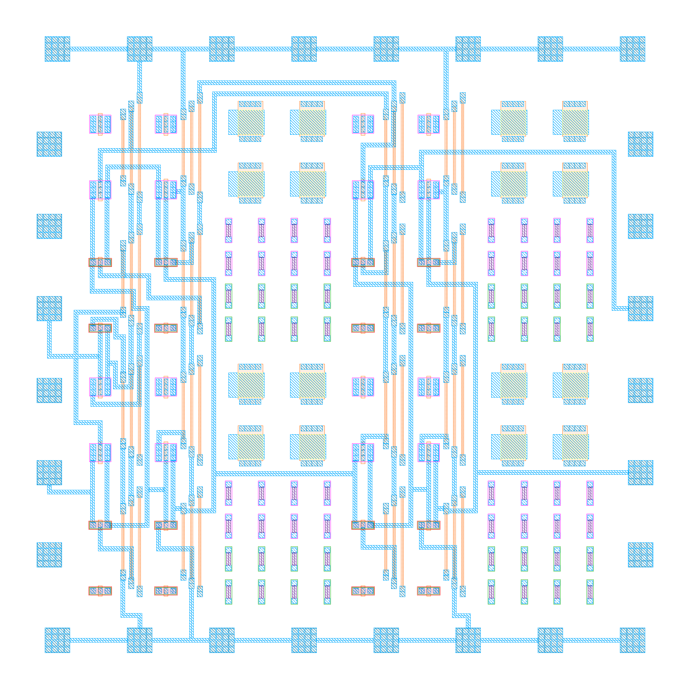

[TGFF](https://github.com/mole99/semicon2023-tgff) has been submitted to the first Minimal Fab Design Contest. It was manufactured, worked as designed and won the special award.

- Designed using the open source ICPS PDK
- Uses the provided element array chip
- Only metal 1 was used to connect the devices

# Tiny Shader TT06

VGA shader unit

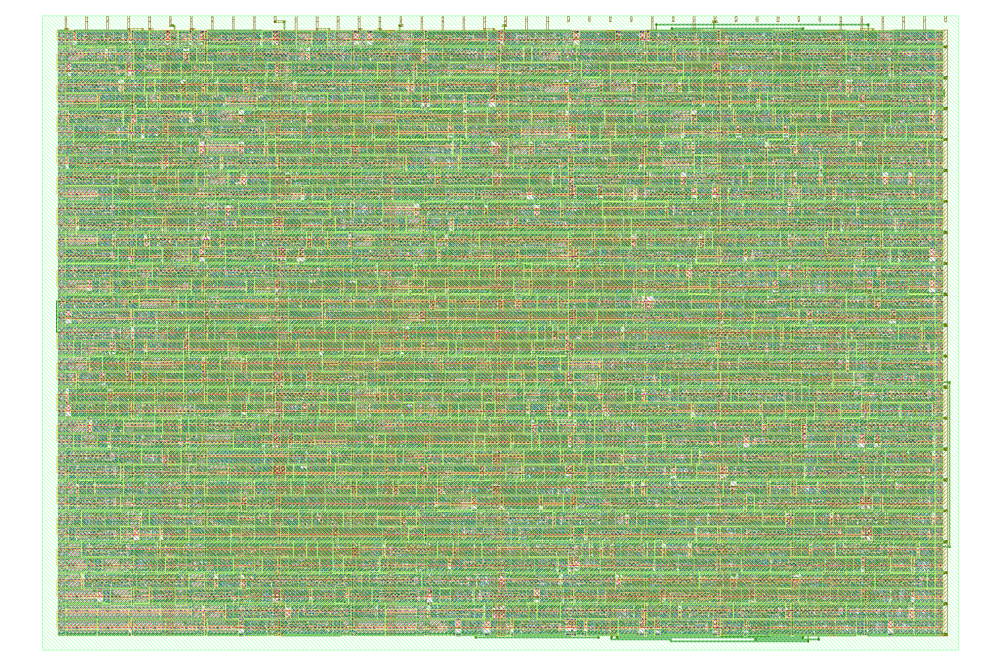

Modern GPUs use fragment shaders to determine the final color for each pixel. Thousands of shading units run in parallel to speed up this process and ensure that a high FPS ratio can be achieved.

Tiny Shader mimics such a shading unit and executes a shader with 10 instructions for each pixel. No framebuffer is used, the color values are generated on the fly. Tiny Shader also offers an SPI interface via which a new shader can be loaded. The final result can be viewed via the VGA output at 640x480 @ 60 Hz, although at an internal resolution of 64x48 pixel.

[Project Link](https://github.com/mole99/tt06-tiny-shader)

# LeoSoC GFMPW-1

An SoC with TRNGs

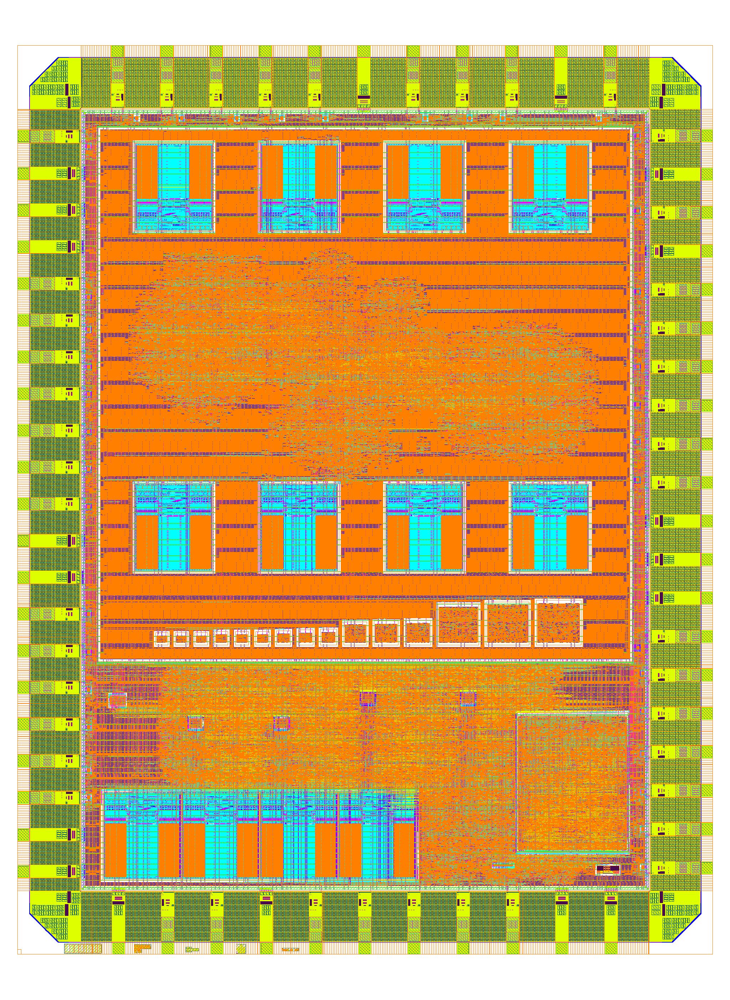

A simple dual-core SoC with true random number generators as payload.

- Two RV32I cores running in parallel
- 32 word direct-mapped instruction cache for each core
- 4kB of shared memory
- SPI flash controller
- 2 UARTs
- 1 GPIO controller (24 I/Os)
- 15 different TRNGs

It uses the foundry provided 512x8 SRAM macros. In total there are 15 different TRNG configurations on board.

The design was submitted to the GFMPW-1 Shuttle Program.

[Project Link](https://github.com/mole99/leosoc-gfmpw-1)

Microscopy image: http://infosecdj.net/map/efabless/gf180mcu-gfmpw1-leosoc-18019f00/infosecdj_mz_nikpa40x_66p/#x=16832&y=23328&z=1
© 2026 InfoSecDJ, CC BY-NC 4.0

# One Sprite Pony TT05

SVGA sprite generator

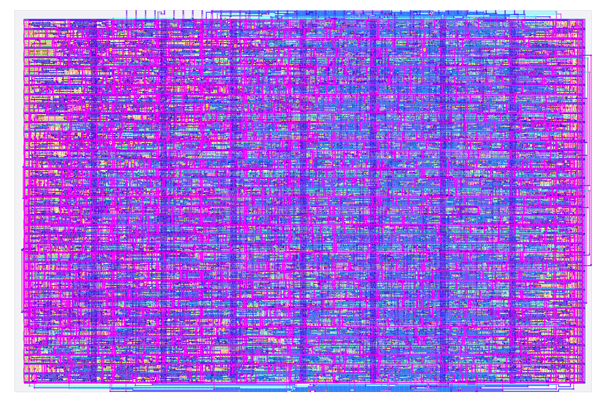

This Verilog design produces SVGA 800x600 60Hz output with a background and one sprite. Internally, the resolution is reduced to 100x75, thus one pixel of the sprite is actually 8x8 pixels. The design can operate at either a 40 MHz pixel clock or a 10 MHz pixel clock by setting a configuration bit.

The design was submitted to Tiny Tapeout 05 for production.

[Project Link](https://github.com/mole99/tt05-one-sprite-pony)

# LeoSoC MPW-8

A simple SoC

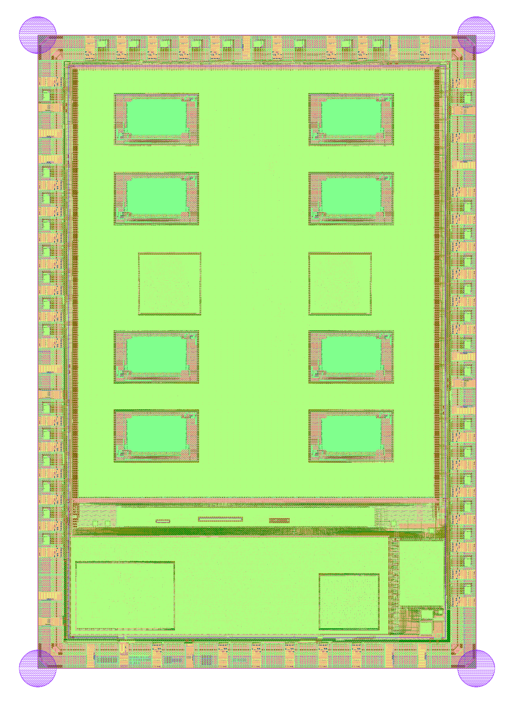

This is a simple SoC with the following:

- 1 LeoRV32 Core (RV32I)
- 8 kB Work RAM
- 8 kB Video RAM (can also be used as Work RAM)
- SVGA Core (800 x 600, 40 MHz)
	- Resolution decreased to 100 x 75 pixel
	- 1 Byte per Pixel with direct color format (BBGGGRRR)
- UART
	- 9600 baud fixed at 40 MHz
- Blink
	- Simple output to blink an LED

Microscopy image: http://infosecdj.net/map/efabless/sky130-mpw8c-leosoc-0008927d/infosecdj_mz_nikpa40x/
© 2026 InfoSecDJ, CC BY-NC 4.0

# Waveform Generator MPW-7

My first chip

A generic waveform generator divided into stimulus and driver units that can be arbitrarily interconnected.

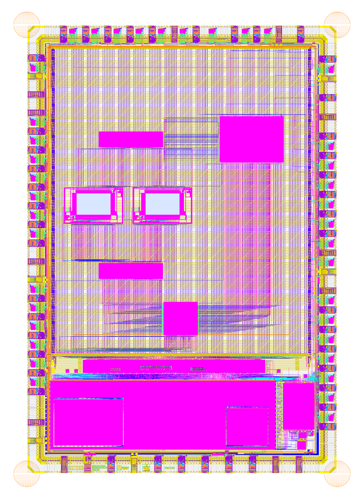

Currently the following blocks are implemented:

### Stimuli

- `wfg_stim_sine`
- `wfg_stim_mem`

### Driver

- `wfg_drive_spi`
- `wfg_drive_pat`

### Various

- `wfg_interconnect`
- `wfg_core`
- `wfg_subcore`
