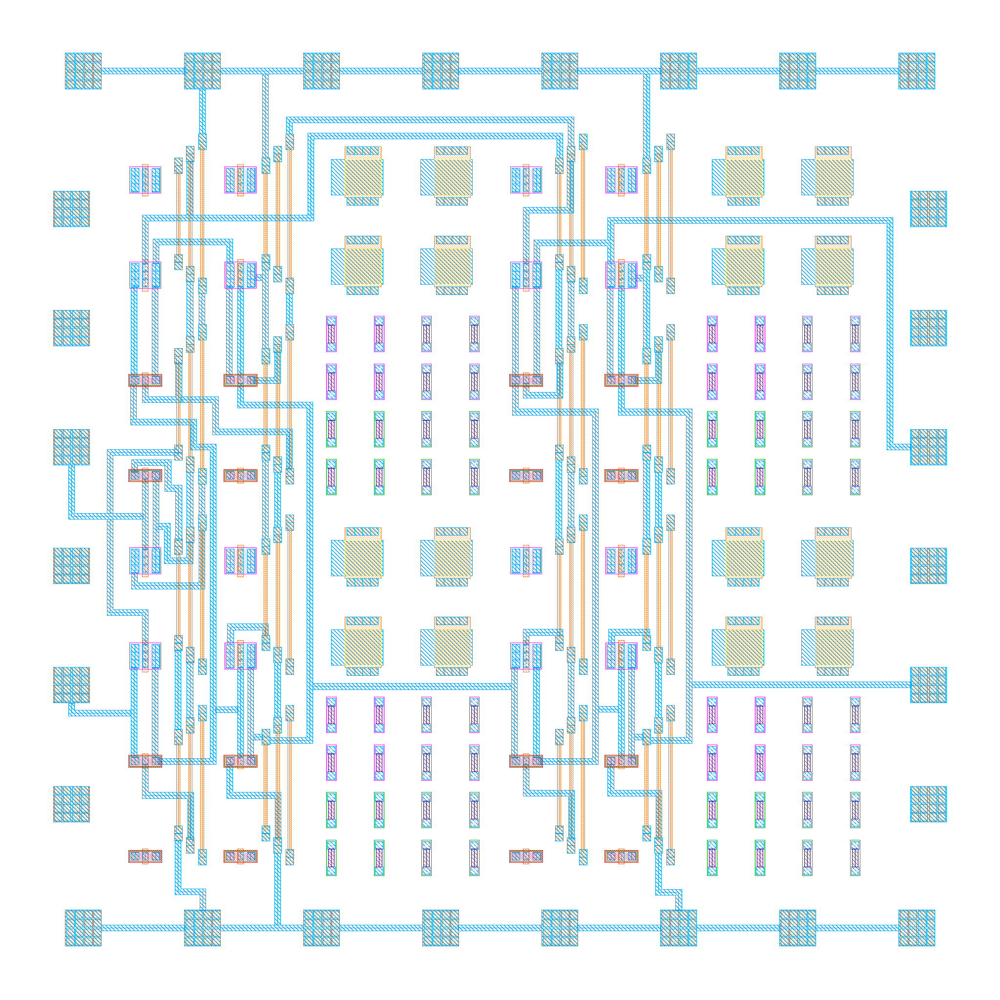

# Chip Gallery

This is the repository where I store the layout for chips or designs that I designed.

# Greyhound IHP 2025

A RISC-V SoC with tightly coupled eFPGA on IHP SG13G2

[Greyhound](https://github.com/mole99/greyhound-ihp) has been submitted to the [IHP-Open-DesignLib](https://ihp-open-ip.readthedocs.io/en/latest/) for fabrication.

- Designed using the [IHP Open Source PDK](https://github.com/IHP-GmbH/IHP-Open-PDK)
- SoC:
  - [CV32E40X](https://github.com/openhwgroup/cv32e40x) RISC-V core from the OpenHW group
  - 8kB SRAM
  - QSPI Flash Controller for XIP (w. cache)
  - QSPI PSRAM controller
  - Highly Configurable UART
  - Fabric Config Peripheral
  - Fabric Peripheral
- FABulous eFPGA
  - 32x I/Os
  - 784x LUT4 + FF (w. carry chain)
  - 98x MUX (Either 1xMUX8, 2xMUX4 or 4xMUX2)
  - 7x SRAM (32 bit-wide, 4kB deep)
  - 7x MAC (8bit*8bit + 20bit)
  - 14x Register file (32x4bit each, 1w1r1r)
  - 1x Global clock network
  - 1x WARMBOOT
  - 1x CPU_IRQ
  - 4x CPU_IF

# Second Minimal Fab Design Contest 2025

Counter, Ringo, ROM and Stdcells

|   |   |   |
|---|---|---|
|   |   |   |

I submitted [three different designs](https://codeberg.org/mole99/minimalfab-design-contest-2024) to the second Minimal Fab Design Contest.

- Designed using the open source ICPS PDK
- Created a minimal stdcell library
- Wrote a simple Place and Route tool
- Created two submissions with a counter, ring-oscillator and ROM using my stdcell library and PnR tool
- Created one submission for the characterization of some of the stdcells

# One Sprite Pony (TTIHP0P2) 

SVGA sprite generator

An updated version of [One Sprite Pony](https://github.com/mole99/ttihp0p2-one-sprite-pony) has been submitted to Tiny Tapeout IHP 0.2

- SVGA 800x600 60Hz output with 2 bits per color (internally reduced to 100x75)
- Sprite with 12x12 pixels
- 4 different colors (6 bit rrggbb)
- 4 different backgrounds
- Uses clock gating for the sprite shift register
- Simplified SPI interface
- Assign new sprite positions only on new line
- Clamp x and y position to prevent uncontrolled shifting of the sprite data

# AICD Playground TT08

A simple mixed-signal design

[AICD Playground](https://github.com/mole99/tt08-aicd-playground) has been submitted to Tiny Tapeout 08

- 8-bit CPU with 64 bytes of work memory
- Levelshifters in both directions
- 3.3V R2R-DAC
- 3.3V Comparator
- Can be programmed as SAR-ADC

# Wirecube TT08

VGA wirecube

[Wirecube](https://github.com/mole99/tt08-wirecube) has been submitted to Tiny Tapeout 08 for the demoscene competition.

- VGA output at 640x480 @ 60 Hz
- Draws lines while racing the beam
- Displays a rotating cube in wireframe rendering

# TGFF Semicon23

Transmission-Gate D Flip-Flop

[TGFF](https://github.com/mole99/semicon2023-tgff) has been submitted to the first Minimal Fab Design Contest. It was manufactured, worked as designed and won the special award.

- Designed using the open source ICPS PDK
- Uses the provided element array chip
- Only metal 1 was used to connect the devices

# Tiny Shader TT06

VGA shader unit

Modern GPUs use fragment shaders to determine the final color for each pixel. Thousands of shading units run in parallel to speed up this process and ensure that a high FPS ratio can be achieved.

Tiny Shader mimics such a shading unit and executes a shader with 10 instructions for each pixel. No framebuffer is used, the color values are generated on the fly. Tiny Shader also offers an SPI interface via which a new shader can be loaded. The final result can be viewed via the VGA output at 640x480 @ 60 Hz, although at an internal resolution of 64x48 pixel.

[Project Link](https://github.com/mole99/tt06-tiny-shader)

# LeoSoC GFMPW-1

An SoC with TRNGs

A simple dual-core SoC with true random number generators as payload.

- Two RV32I cores running in parallel
- 32 word direct-mapped instruction cache for each core
- 4kB of shared memory
- SPI flash controller
- 2 UARTs
- 1 GPIO controller (24 I/Os)
- 15 different TRNGs

It uses the foundry provided 512x8 SRAM macros. In total there are 15 different TRNG configurations on board.

The design was submitted to the GFMPW-1 Shuttle Program.

[Project Link](https://github.com/mole99/leosoc-gfmpw-1)

# One Sprite Pony TT05

SVGA sprite generator

This Verilog design produces SVGA 800x600 60Hz output with a background and one sprite. Internally, the resolution is reduced to 100x75, thus one pixel of the sprite is actually 8x8 pixels. The design can operate at either a 40 MHz pixel clock or a 10 MHz pixel clock by setting a configuration bit.

The design was submitted to Tiny Tapeout 05 for production.

[Project Link](https://github.com/mole99/tt05-one-sprite-pony)

# LeoSoC MPW-8

A simple SoC

This is a simple SoC with the following:

- 1 LeoRV32 Core (RV32I)
- 8 kB Work RAM
- 8 kB Video RAM (can also be used as Work RAM)
- SVGA Core (800 x 600, 40 MHz)
	- Resolution decreased to 100 x 75 pixel
	- 1 Byte per Pixel with direct color format (BBGGGRRR)
- UART
	- 9600 baud fixed at 40 MHz
- Blink
	- Simple output to blink an LED

# Waveform Generator MPW-7

My first chip

A generic waveform generator divided into stimulus and driver units that can be arbitrarily interconnected.

Currently the following blocks are implemented:

### Stimuli

- `wfg_stim_sine`
- `wfg_stim_mem`

### Driver

- `wfg_drive_spi`
- `wfg_drive_pat`

### Various

- `wfg_interconnect`
- `wfg_core`
- `wfg_subcore`
